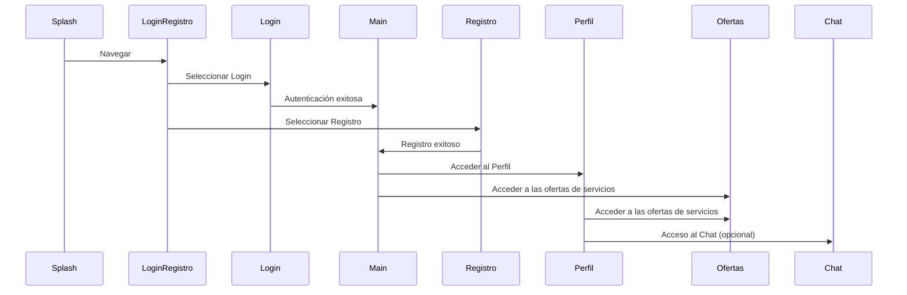

# 🌟 JustHelp

**JustHelp** es una innovadora aplicación que conecta a personas que necesitan un servicio o herramienta con aquellas que pueden ofrecer su ayuda. Su objetivo es facilitar la colaboración y el acceso a recursos de manera eficiente, accesible y amigable.

---

## 🧭 Navegación

La aplicación está diseñada con un sistema de usuarios, por lo que es necesario crear un **perfil** para aprovechar todas las funcionalidades. A continuación, te mostramos un diagrama de secuencias que ilustra cómo se interrelacionan las **pantallas** y flujos dentro de la app:

## 🎨 Guía de Estilos

Nuestro objetivo es crear una **identidad visual única** que refleje el propósito de la aplicación. En este sentido, estamos trabajando en la definición de elementos clave como un eslogan atractivo, una paleta de colores significativa y una tipografía adecuada para la experiencia del usuario.

Consulta el borrador de nuestra **Guía de Estilo** en el siguiente enlace:  
[📝 Documento de Guía de Estilo](https://docs.google.com/document/d/1To0nNd6fP_WXIR3FwjGGhG-NOePMouthCsHCJ_IShss/edit?usp=sharing)

---

## 📅 Comunicación y Gestión del Proyecto

Para la gestión eficiente del proyecto, estamos utilizando **Trello**, una herramienta para organizar las tareas y monitorear el progreso de nuestro trabajo. Además, para mantener una comunicación fluida, utilizamos **Slack** como canal de comunicación para nuestras reuniones diarias (dailys) y para el seguimiento del avance.

---

## 📱 Prototipo

El prototipo interactivo de la aplicación ha sido creado en **Figma**, y puedes explorarlo para tener una visión más clara de la experiencia de usuario. Haz clic en el siguiente enlace para acceder al prototipo:

---

## 🚀 ¡Únete a Nosotros!

Estamos muy emocionados con el desarrollo de **JustHelp** y siempre estamos buscando nuevos colaboradores, ideas y sugerencias. Si te interesa formar parte de este proyecto, no dudes en ponerte en contacto con nosotros.
