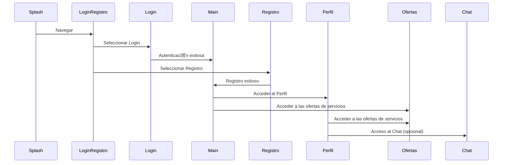
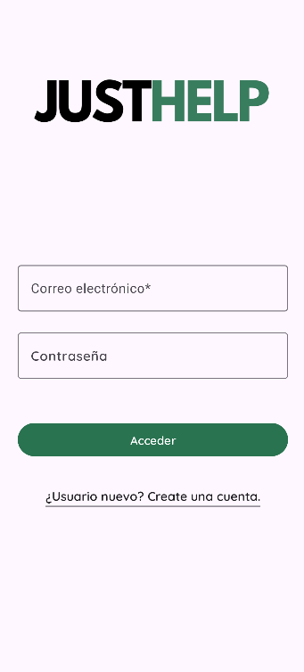
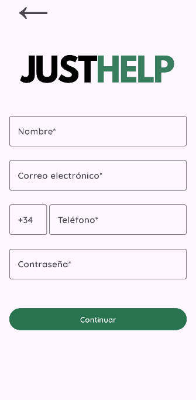
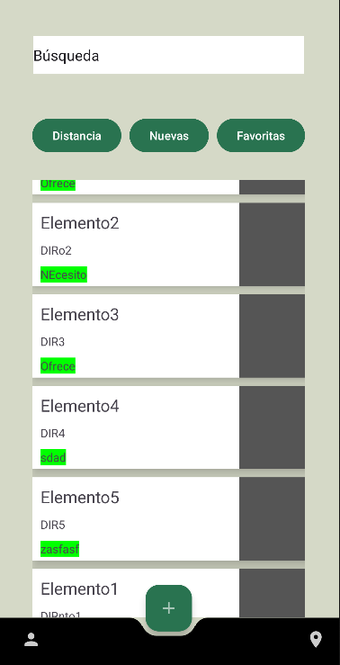
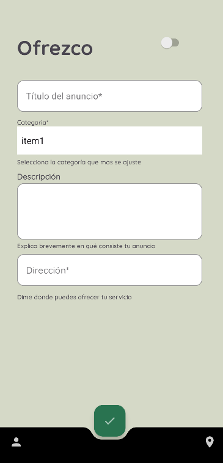
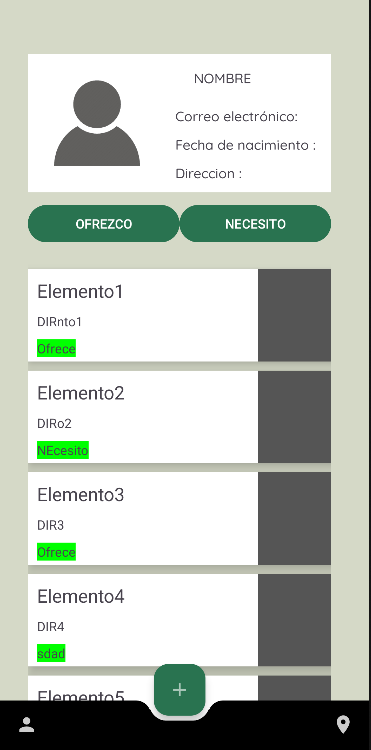

# 🌟 JustHelp

**JustHelp** es una innovadora aplicación que conecta a personas que necesitan un servicio o herramienta con aquellas que pueden ofrecer su ayuda. Su objetivo es facilitar la colaboración y el acceso a recursos de manera eficiente, accesible y amigable.

## 🧭 Navegación

La aplicación está diseñada con un sistema de usuarios, por lo que es necesario crear un **perfil** para aprovechar todas las funcionalidades. A continuación, te mostramos un diagrama de secuencias que ilustra cómo se interrelacionan las **pantallas** y flujos dentro de la app:

## 🎨 Guía de Estilos

Nuestro objetivo es crear una **identidad visual única** que refleje el propósito de la aplicación. En este sentido, estamos trabajando en la definición de elementos clave como un eslogan atractivo, una paleta de colores significativa y una tipografía adecuada para la experiencia del usuario.

Consulta el borrador de nuestra **Guía de Estilo** en el siguiente enlace:      
[📝 Documento de Guía de Estilo](https://docs.google.com/document/d/1To0nNd6fP_WXIR3FwjGGhG-NOePMouthCsHCJ_IShss/edit?usp=sharing)
    
---   
## 📅 Comunicación y Gestión del Proyecto

Para la gestión eficiente del proyecto, estamos utilizando **Trello**, una herramienta para organizar las tareas y monitorear el progreso de nuestro trabajo. Además, para mantener una comunicación fluida, utilizamos **Slack** como canal de comunicación para nuestras reuniones diarias (dailys) y para el seguimiento del avance.

[ Tablero_de_Trello](https://trello.com/invite/b/6751730388e69d7bfda0d0b7/ATTI2766aa5779fe8fd042ab8ea5516d7bce6B4A2557/app-de-servicios)
---   
## 📱 Prototipo

El prototipo interactivo de la aplicación ha sido creado en **Figma**, y puedes explorarlo para tener una visión más clara de la experiencia de usuario. Haz clic en el siguiente enlace para acceder al prototipo:

    
---
##  Avances
Hemos implementado las pantallas de Login, register,main,perfil y ofrecer; quedaría añadir los anuncios y ver el contenido mediante la base de datos FireBase

Una pantalla de Register 

**Ambas completamente funcionales.**

Una pantalla Main en la que vamos a ver los anuncios de los usuarios van publicando 

La pantalla para crear anuncios se accede con el ButtonActionBar 

Cada usuario tiene un perfil, completamente personalizable en el que se pueden consultar los anuncios que ha publicado 

A continuación hay una grabación de la aplicación para ver su funcionalidad hasta el momento :

---   
## 🚀 ¡Únete a Nosotros!

Estamos muy emocionados con el desarrollo de **JustHelp** y siempre estamos buscando nuevos colaboradores, ideas y sugerencias. Si te interesa formar parte de este proyecto, no dudes en ponerte en contacto con nosotros.

Hecha con mucho amor por Diego Hernández, Laura Marcos y Alex Riofrio