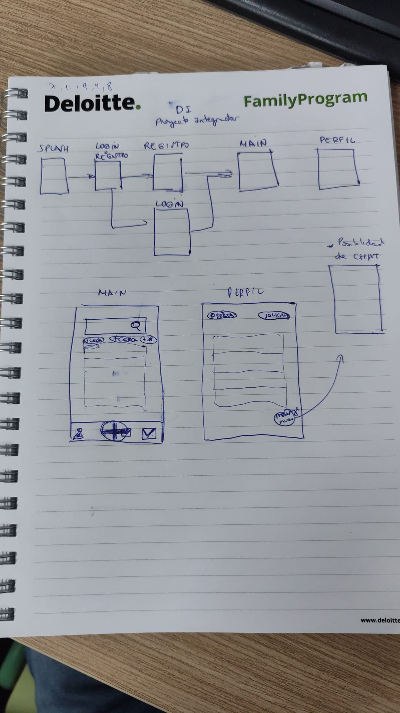

# JustHelp

La aplicación conecta a personas que necesiten de un servicio/herramienta con personas que ofrezcan su ayuda.

## Navegación

La aplicación consta con un sistema de usuarios, por lo que es necesario crearse un **perfil** para poder usar la app, a continuación se muestra un esquema de como se relacionan las **pestañas** entre sí.

## Guía de estilos

Para diseñar la app estamos realizando un trabajo de darle identidad a la app por medio de una búsqueda de identidad, eslogan , colores significativos y fuente acorde a la función de la app
Guía de estilo : <a href="https://docs.google.com/document/d/1To0nNd6fP_WXIR3FwjGGhG-NOePMouthCsHCJ_IShss/edit?usp=sharing">Documento</a>

## Comunicación y gestión del proyecto

Para la gestión de proyecto estamos usando la herramienta de **trello** para organizar las tareas del proyecto e ir midiendo cuanto progreso se lleva del mismo, a su vez para comunicación usamos **slack** a modo de chat profesional para nuestras dailys e ir viendo como vamos avanzando
